# 如果出现无法同步请检查下代码是否最新如果非最新请重新fork sync代码后删除db/garmin.db文件重跑一遍！！！
## 致谢
- 本脚本佳明模块代码来自@[yihong0618](https://github.com/yihong0618) 的 [running_page](https://github.com/yihong0618/running_page) 个人跑步主页项目,在此非常感谢@[yihong0618](https://github.com/yihong0618)大佬的无私奉献！！！

## 注意
由于高驰平台只允许单设备登录，同步期间如果打开网页会影响到数据同步导致同步失败，同步期间切记不要打开网页。

## 参数配置
|       参数名       |                备注                |        案例        |
| :----------------: | :--------------------------------: | :----------------: |
|    GARMIN_EMAIL    |          佳明登录帐号邮箱          |                    |
|  GARMIN_PASSWORD   |            佳明登录密码            |                    |
| GARMIN_AUTH_DOMAIN | 佳明区域（国际区填:COM 国区填:CN） |    (COM or CN)     |
| GARMIN_NEWEST_NUM  |            最新记录条数            | (默认0，可写大于0) |
|    COROS_EMAIL     |           高驰 登录邮箱            |                    |
|   COROS_PASSWORD   |             高驰 密码              |                    |

## Github配置步骤
### 1.参数配置
打开**Setting**
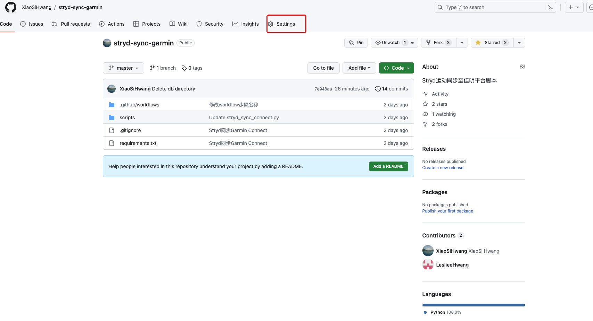
找到**Secrets and variables**点击**New repository secret**按钮

打开**New repository secret**后将上述的参数填入，下图以佳明帐号为例,**Name**填写参数名,**Secret**填写你的信息，重复以上步骤填入五个参数即可
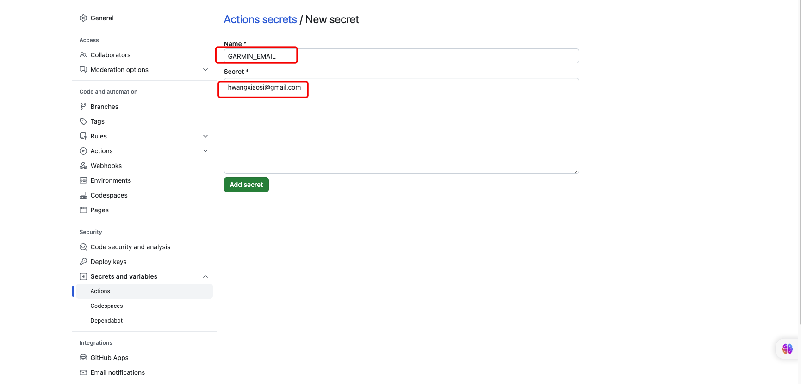

### 2.配置WorkFlow权限
打开**Setting**找到**Actions**点击**General**按钮,按照下图勾选并save
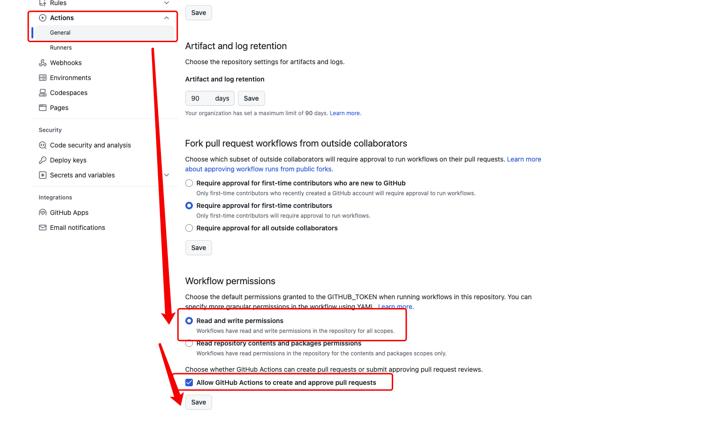

### 3. wrokflow配置
打开**github/workflows/garmin-sync-coros.yml**文件,将**GITHUB_NAME**更改为你的Github用户名、**GITHUB_EMAIL**更改为你的Github登录邮箱，更改步骤如下:
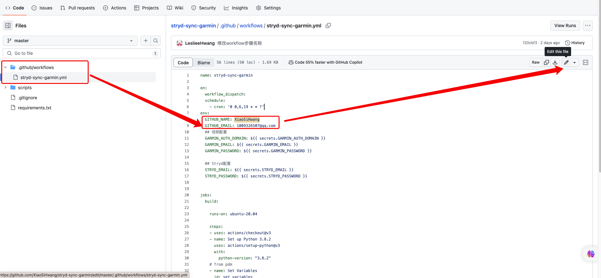
更改完成后点击右上角**Commit changes...**提交即可
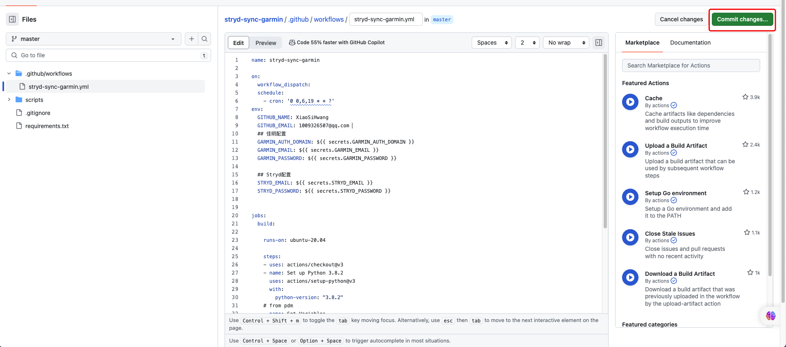

## 重新fork项目步骤
点击页面上**Sync Frok**然后点击**Dicard commit**即可
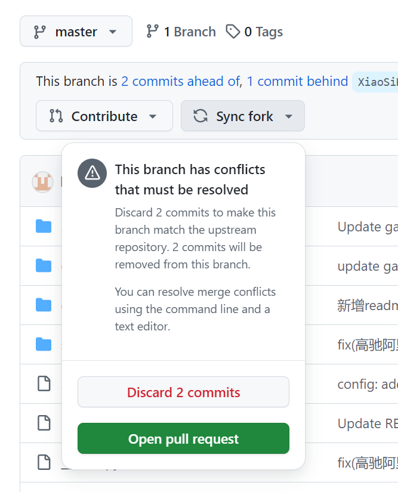
## 删除db步骤
按照图片顺序执行即可
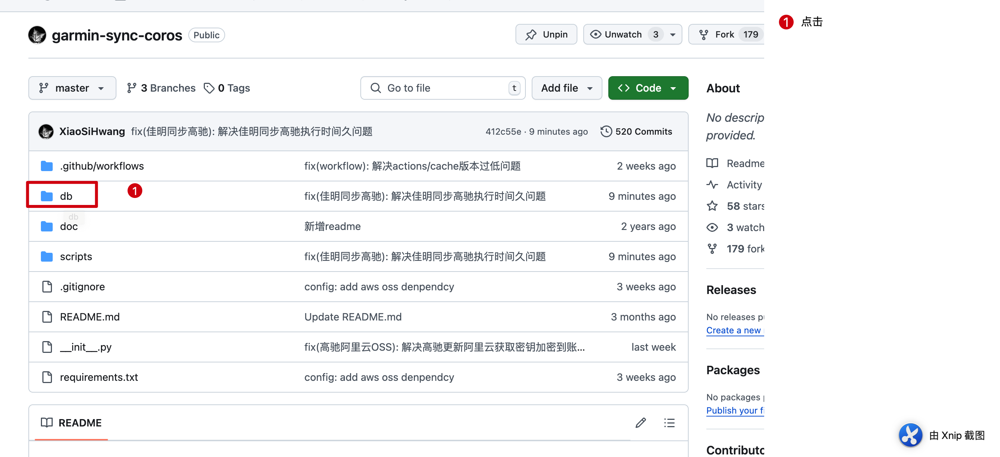
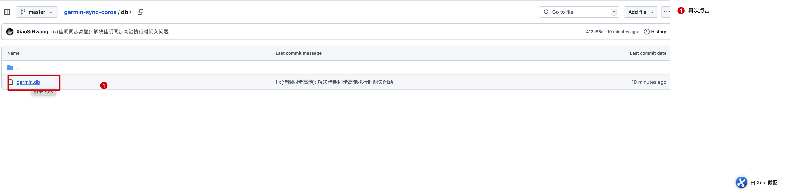
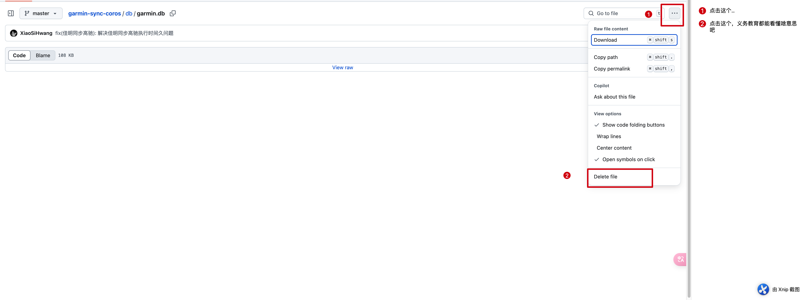
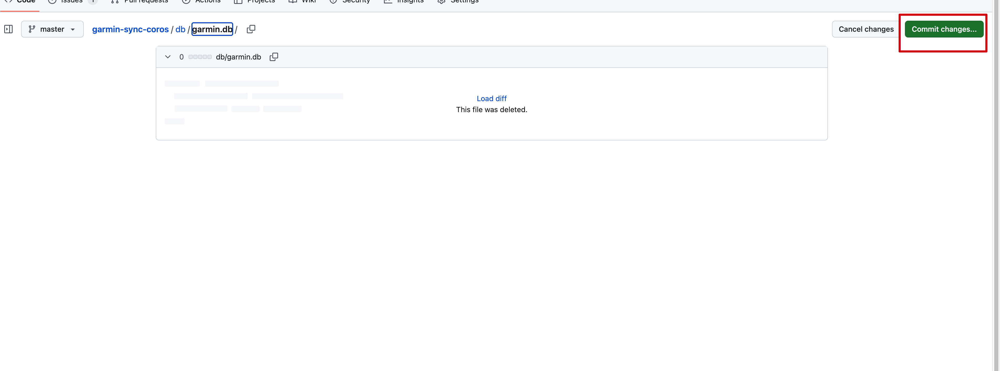
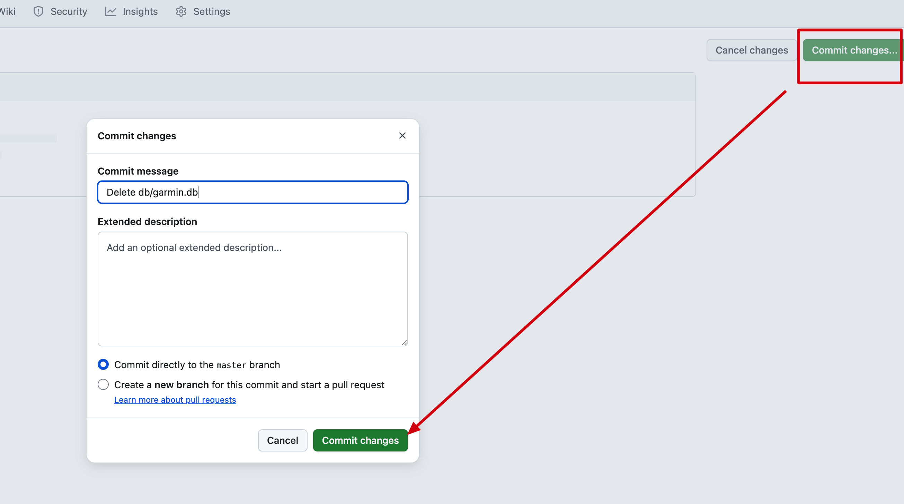
删除完后等脚本自己执行即可